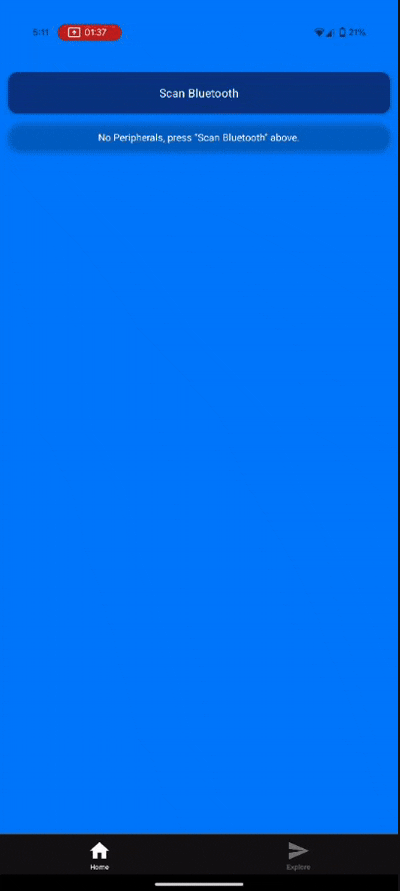

## Get started

1. Install dependencies

   ```bash
   npm install
   ```

2. Start the app

   ```bash
    npx expo start
   ```

3. Run development build

   ```bash
    npx expo run:android
   ```

   ```bash
    npx expo run:ios
   ```
